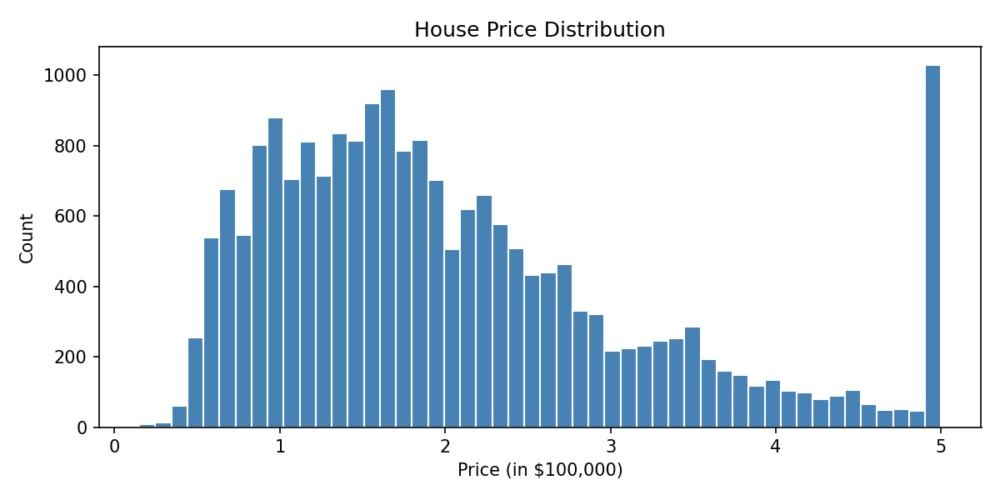
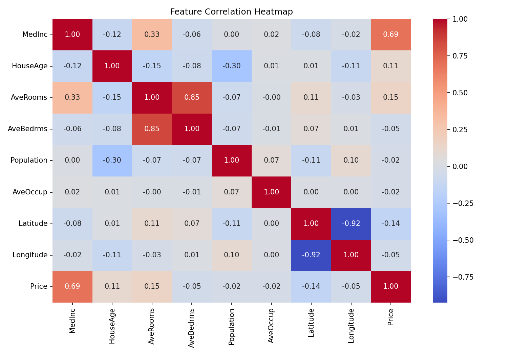
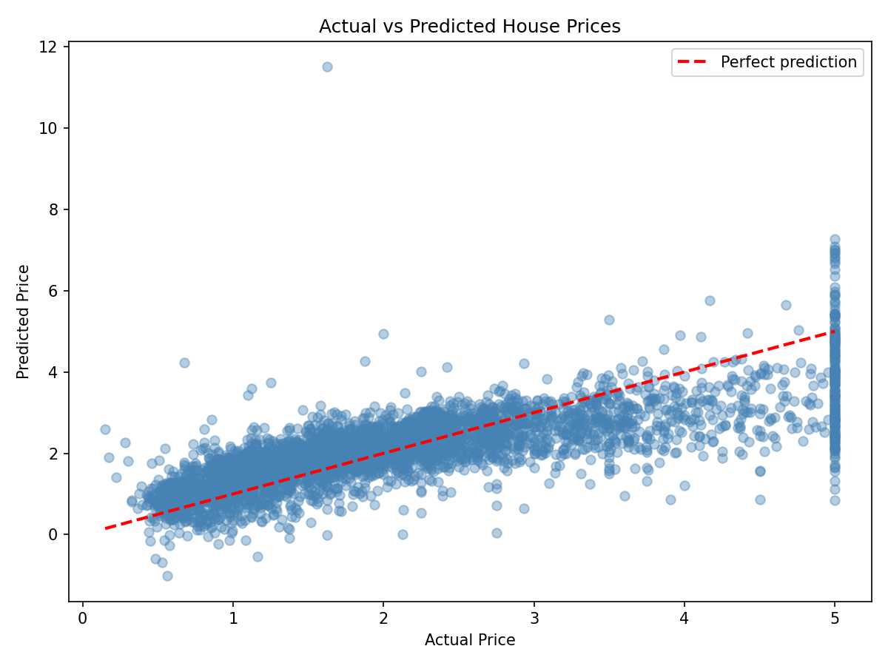

# 🏠 House Price Prediction

Built a Linear Regression model on California housing data.

## 📊 Results
- R² Score: 0.60
- Used data of 20,640 houses

## 📈 Visualizations

## 🛠️ Tools
Python | Pandas | Scikit-learn | Matplotlib | Seaborn

## ▶️ How to Run
pip install pandas numpy scikit-learn matplotlib seaborn
jupyter notebook house_price_prediction.ipynb
